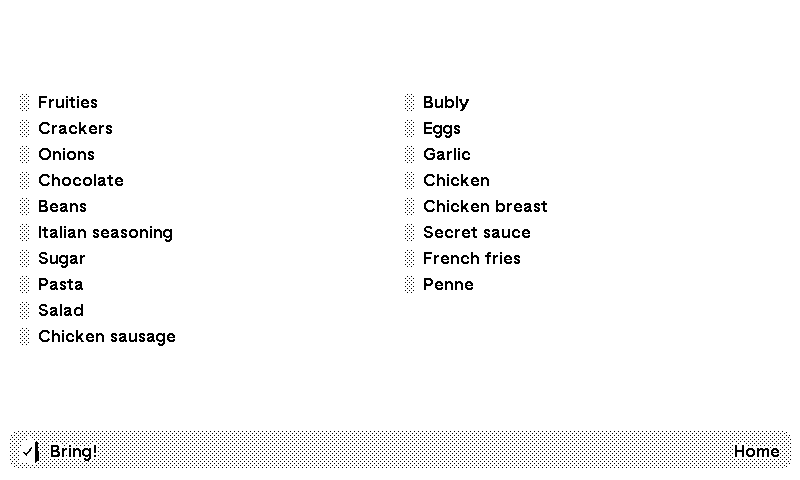

# Bring! shopping list TRMNL plugin


Unofficial Bring! plugin for TRMNL



## How to use

### 1. Create a private plugin on TRMNL dashboard

First, create a [private plugin](https://help.usetrmnl.com/en/articles/9510536-private-plugins) with webhook strategy.

You then need to create the view templates for your plugin. Go to the Edit Markup page:

1. paste the contents of [full-height.liquid](views/full-height.liquid) into the Full and and Half Vertical tabs.

1. paste the contents of [half-height.liquid](views/half-height.liquid) into the Half Horizontal and and Quadrant tabs.

### 2. Run the backend service

The backend service runs indefinitely, queries Bring! every 15 minutes to grab the list of items in your shopping list and sends the list to TRMNL if the shopping list changed since the last query.

Have these handy:

1. Bring! account email
1. Bring! account password
1. TRMNL plugin webhook URL. You can find this at the bottom of your private plugin page.

*Note:* If you signed up to Bring! using Apple ID or Google Sign-in or other SSOs you need to create password first. More [here](https://www.home-assistant.io/integrations/bring/#prerequisites).

You can either run the backend service through docker or run the script directly.

#### Docker

Pull the docker image and pass the email, password and webhook url as env variables.

```bash
docker pull ghcr.io/yshrdbrn/trmnl-bring-plugin:main

docker run
    -d
    --name='BringTRMNLPlugin'
    -e 'EMAIL'='<email>'
    -e 'PASSWORD'='<password>'
    -e 'WEBHOOK_URL'='<url>'
    'ghcr.io/yshrdbrn/trmnl-bring-plugin:main'
```

#### Run the script directly

Clone the repo and rename `.env.example` to `.env` and put in your email, password and webhook url there. Then run the script:

```bash
python3 -m venv venv
pip install -r requirements.txt
python ./main.py
```
